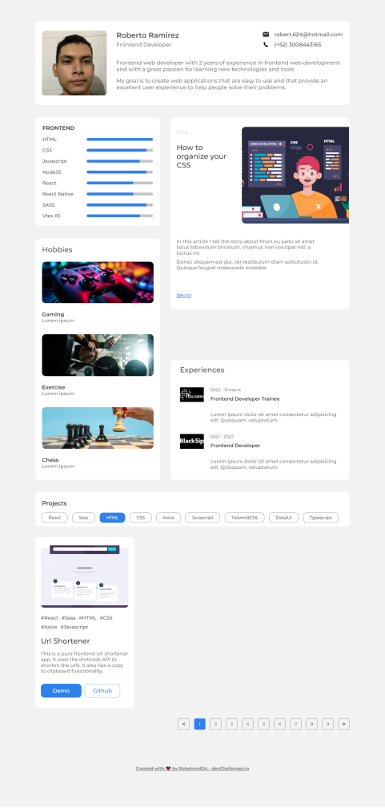
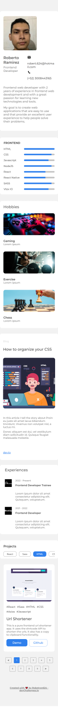

# Astro Starter Kit: Basics

## 🎨 Screenshots




## 🚀 Project Structure

Inside of this Astro project, you'll see the following folders and files:

```text
/
├── .gitignore
├── .vscode/
│   ├── extensions.json
│   └── launch.json
├── astro.config.mjs
├── package.json
├── public/
│   ├── images/
│   │   ├── experiences/
│   │   ├── hobbies/
│   │   └── projects/
├── README.md
├── src/
│   ├── assets/
│   │   └── fonts/
│   │       ├── Montserrat-Bold.ttf
│   │       ├── Montserrat-Medium.ttf
│   │       └── Montserrat-SemiBold.ttf
│   ├── components/
│   │   ├── MainSection/
│   │   │   ├── LeftSection/
│   │   │   ├── MainSection.astro
│   │   │   └── RightSection/
│   │   ├── PersonalInfoCard.astro
│   │   └── Projects/
│   │       ├── hooks/
│   │       ├── ProjectCard.jsx
│   │       ├── ProjectCard.scss
│   │       └── ...
│   ├── env.d.ts
│   ├── layouts/
│   │   └── Layout.astro
│   ├── pages/
│   │   └── index.astro
│   └── vars.scss
└── tsconfig.json
```

Astro looks for `.astro` or `.md` files in the `src/pages/` directory. Each page is exposed as a route based on its file name.

There's nothing special about `src/components/`, but that's where we like to put any Astro/React/Vue/Svelte/Preact components.

Any static assets, like images, can be placed in the `public/` directory.

## 🧞 Commands

All commands are run from the root of the project, from a terminal:

| Command                   | Action                                           |
| :------------------------ | :----------------------------------------------- |
| `npm install`             | Installs dependencies                            |
| `npm run dev`             | Starts local dev server at `localhost:4321`      |
| `npm run build`           | Build your production site to `./dist/`          |
| `npm run preview`         | Preview your build locally, before deploying     |
| `npm run astro ...`       | Run CLI commands like `astro add`, `astro check` |
| `npm run astro -- --help` | Get help using the Astro CLI                     |

## 📕 Resources

- [Astro Documentation](https://docs.astro.build/)
- [React Documentation](https://reactjs.org/docs/getting-started.html)
- [Sass Documentation](https://sass-lang.com/documentation)
- [TypeScript Documentation](https://www.typescriptlang.org/docs/)
- [nanostores library](https://github.com/nanostores/nanostores)
- [Astro React integration](https://docs.astro.build/en/guides/integrations-guide/react/)

## 🔗 Project Links

- [GitHub](https://github.com/Robertron624/responsive-portfolio)
- [Live Site]()

## 📚 Tutorials

- [How to Implement Pagination in React](https://hygraph.com/blog/react-pagination)
